(for Jan 27 2026 meeting)

>[!NOTE]
> This is not meant to be a formal write-up; but instead an in-between of the meeting contents and the final report. The choice of informal writing is purely utilitarian for speed.

In our previous meeting, we discussed the possibility that images from the testing dataset are simply too different from its contemporaries in the training/validation dataset; thus explaining the abhorrent performance decline when evaluating on unseen test images. Adhering to garbage in, garbage out, the hypothesis is that the model simply cannot learn any features useful for classifying the test images for they do not exist in the training data. If proven true, this would mean that we have been chasing a unicorn the entire time, being an issue of data breadth rather than model depth. 

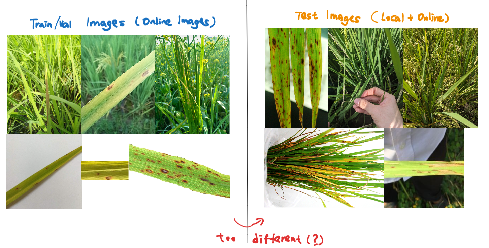

## Training Data too Different from the Test Data

To prove this, we need a way to quantify how different the two datasets are from each other. Formally, deep neural networks assume that training and test data are independent and identically distributed[^1] . Failure to uphold this results in a model that is not representative of the target testing data, due to the **distribution shift** between the training and testing data. There are mainly two types of distribution shift: domain shift (testing on unseen domains) and subpopulation shift (the domains of testing data are seen but underrepresented in the training data).[^2] For simplicity, we will not be differentiating between the two and focus on simply identifying a distribution shift.

Image data can be particularly hard to characterize under distribution shift due to its high dimensionality and complex, multimodal structure. Typically, modern approaches for detecting distribution shift in high-dimensional data like images rely on deep learning models or deep representations (e.g. [^3][^4]). As we want a concrete threshold for quantifying whether a distribution shift exists, simpler statistical approaches are a better fit. Maximum Mean Discrepancy[^5] is one such metric, classically used to quantify differences between probability distributions. The Torchdrift implementation [^6] is used here. The detector uses a kernelized MMD two-sample test with a Gaussian kernel to quantify distributional differences between datasets (we are comparing the features of the trained model at inference between datasets in this case) and identify statistically significant drift via permutation testing.

A p-score less than 0.05 [^7] is the rule-of-thumb threshold for a significant distribution drift.
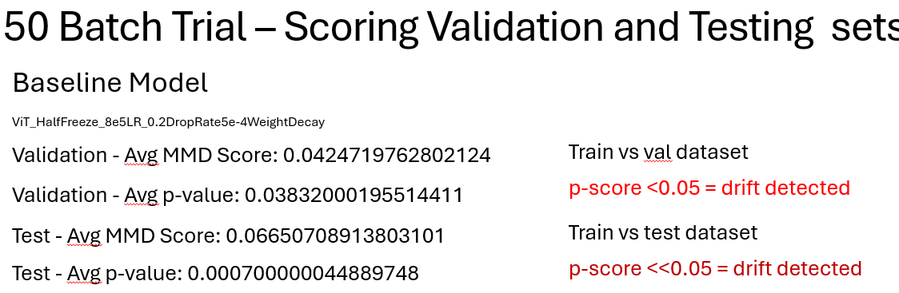

Results for this test strongly indicates a distribution shift between the features in the training dataset and testing dataset. It is important to mention that this is not a be-all-end-all conclusive test. However, given the consistent performance degradation and training divergence between the two datasets (describe in next section), it may be worth trying a data-centric rather model-centric approach to allow the deep learning models an easier time in capturing the disease relevant features applicable to both datasets.

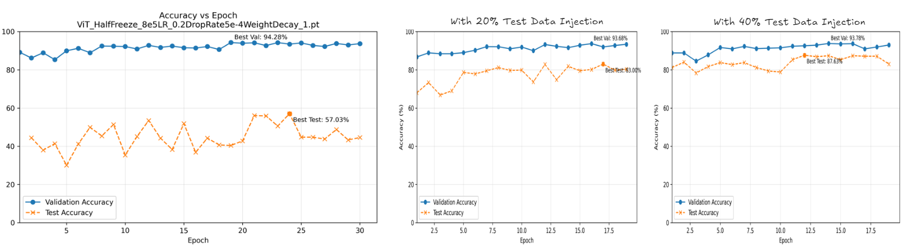
In injecting some test data into the training data, the accuracy jumps to over 80%. Injected images are random according to the class distribution of the testing dataset. Note that some stray online images are obtained for the classes in which there is not enough data to satisfy the injection. A total of 100 images are obtained, bringing the total testing data from 619 -> 719 for this demonstration. 

[^1]: https://arxiv.org/html/2403.02714v1 
[^2]: https://github.com/weitianxin/awesome-distribution-shift
[^3]: https://pubmed.ncbi.nlm.nih.gov/38724581/ 
[^4]: https://proceedings.neurips.cc/paper_files/paper/2023/file/4791edcba96fbd82a8962b0f790b52c9-Paper-Conference.pdf
[^5]: https://papers.nips.cc/paper_files/paper/2019/file/846c260d715e5b854ffad5f70a516c88-Paper.pdf
[^6]: https://torchdrift.org/detectors.html
[^7]: https://pmc.ncbi.nlm.nih.gov/articles/PMC10232224/

## What Problems are evident during Training?

### 1. Poor Testing Accuracy (especially when compared to validation accuracy)

(to complete)
**Validation Accuracies**

|              Model              | Overall Val |
| :-----------------------------: | :---------: |
|       **halfViTBaseline**       |    0.901    |
| **ClassSpecificCrossAttention** |    0.925    |
|          **PlantXViT**          |    0.816    |
|        **SE-ResNet-HKD**        |    0.955    |

**Testing Accuracies**

|              Model              | Overall Test / 619 | BLB / 144 | BLS / 16 |  BPB / 3   | Blast / 62 | Brown Spot / 136 | Dead Heart / 1 | Hispa / 74 | Normal / 167 | Sheath Blight / 16 |
| :-----------------------------: | :----------------: | :-------: | :------: | :--------: | :--------: | :--------------: | :------------: | :--------: | :----------: | :----------------: |
|       **halfViTBaseline**       |       0.4895       |  0.6667   |  0.1875  |   0.6667   |   0.5323   |      0.5882      |     1.0000     |   0.3243   |    0.3473    |       0.3750       |
| **ClassSpecificCrossAttention** |     **0.6220**     |  0.6319   |  0.3750  |   0.6667   |   0.4677   |      0.6250      |     1.0000     |   0.5270   |  **0.7425**  |       0.5000       |
|          **PlantXViT**          |       0.3538       |  0.3056   |  0.1875  |   0.6667   | **0.6613** |      0.5147      |     0.0000     |   0.3649   |    0.1377    |     **0.5625**     |
|        **SE-ResNet-HKD**        |       0.4992       |  0.6458   |  0.1875  | **1.0000** |   0.5323   |      0.4559      |     1.0000     |   0.1081   |    0.5988    |       0.3750       |

There is a gargantuan drop in accuracies between the best validation and best testing accuracies.  Furthermore, the models do not have a consistent scapegoat class to discard that massively boosts the performance in the testing data (the models average performing for the classes that have a larger number of testing images). 

### 2. Unstable Testing Accuracy throughout Training
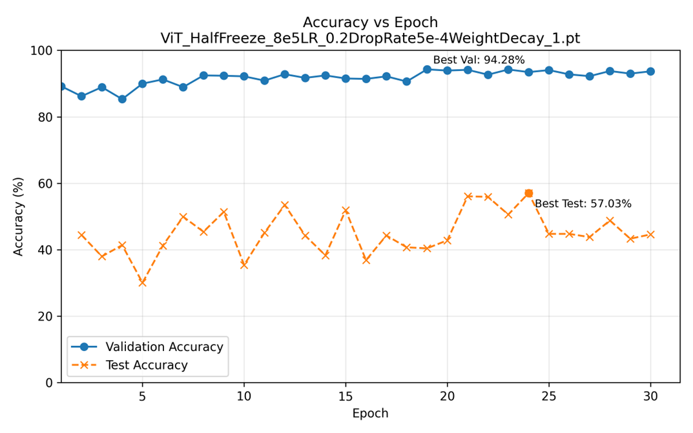
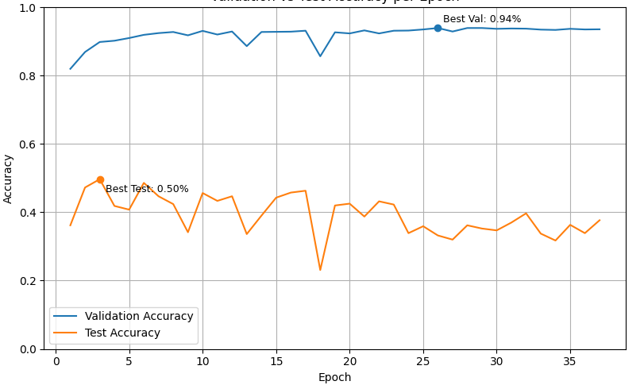

The second issue lies in the instability of testing performance across training epochs. Unlike validation accuracy, which generally improves in a smooth and monotonic manner, testing accuracy exhibits erratic behavior, peaking at seemingly arbitrary points during training. Testing accuracy can peak very early on in training and subsequently fluctuate aggressively without a clear trend. This is a possible indicator of the model learning representations that do not generalize consistently to the testing distribution.

One observation made is that freezing some of the early layers of a model dampens the fluctuation effect to a small extent, especially in earlier epochs.
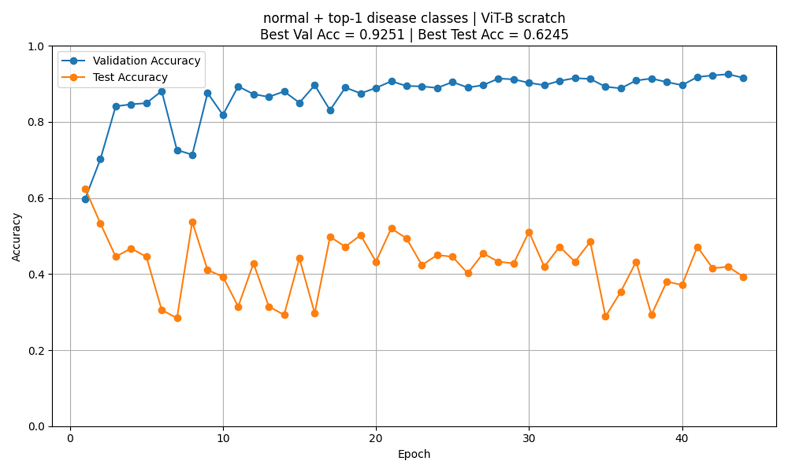
no freeze example

## How can we make the Training Data have more distributional similarity to the Testing Data?

>[!NOTE]
> Traditionally this question falls under domain adaptation. However as we established before, applying domain adaptation did not show much meaningful improvements, possibly due to the testing dataset being too small.

### 1. Removing Severe Edge Cases

The most obvious thing we can do is to remove the testing samples in which the visual or semantic concept is entirely absent from the training distribution. This prevents the evaluation from being confounded by samples that the model could not reasonably be expected to recognize. 

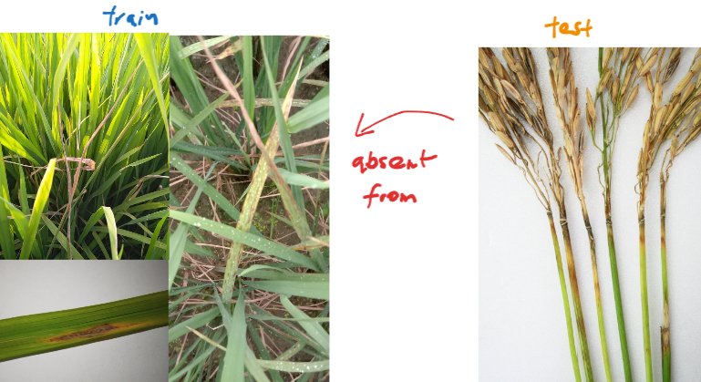

One such case is the test set containing neck blast images under the general blast label, while the training data only includes leaf blast. Although the training data does contain a small amount of images where the neck is present in a black infected crop, the neck blast cases in the test image is a severe edge case whereby it has no leaves at all. Given that the training data is predominantly leaf images, it may be unreasonable for the model to pick up the nuance of neck lesions specifically. 

23 (out of 62 blast images) are removed based on this.

baseline
>`best test acc: 0.5702746510505676  best val acc 0.942791759967804`
	
neck rot removed
>`best test acc: 0.5938804149627686  best val acc 0.942791759967804`

>[!IMPORTANT]
>As expected, this resulted in a small boost in the testing accuracy.
___
>[!NOTE]
>As discussed before, to combat the low class counts some stray online images from IRRI, etc. are added to the training data. It should be stressed that disease images are very scarce. The updated class distribution after removing the neck blast images is shown below.

>[!IMPORTANT]
>All subsequent experiments use this as the testing dataset or its derivative.

___

### 2. Simplifying the Problem

At face value, simplifying the classification task by removing ambiguous samples or constraining the visual scope should make the learning problem easier. 
#### i. Keep only training images where visual disease characteristic is clearly present

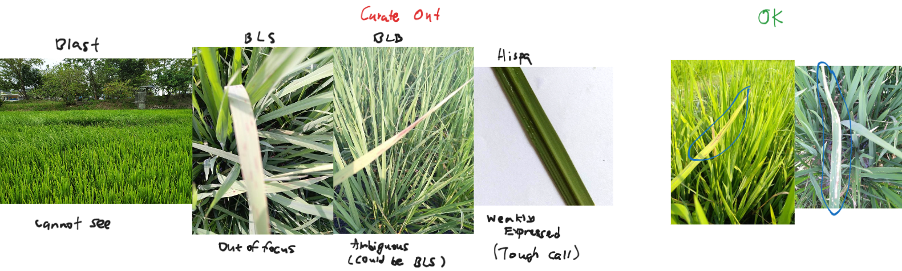

This setting removes samples that are out of focus, weakly expressed, partially occluded, visually ambiguous, or otherwise difficult for a human to classify with confidence when looking at the unmagnified image. The intention is to provide the model with cleaner supervision with the goal of isolating definitive visual cues.

baseline
>`best test acc: 0.5702746510505676  best val acc 0.942791759967804`
	
curated train dataset
>`best test acc: 0.4200323224067688  best val acc 0.8077803254127502`

Surprisingly, this resulted in degradation of both the test and validation accuracies.

| TRAIN  | old  | curated |
| ------ | ---- | ------- |
| blb    | 2656 | 1986    |
| bls    | 409  | 369     |
| bpb    | 337  | 303     |
| blast  | 3629 | 2608    |
| bs     | 2873 | 2616    |
| dh     | 1442 | 1351    |
| hispa  | 2374 | 791     |
| normal | 3719 | 3291    |
| sb     | 912  | 901     |

#### ii. Scope down to leaf images only

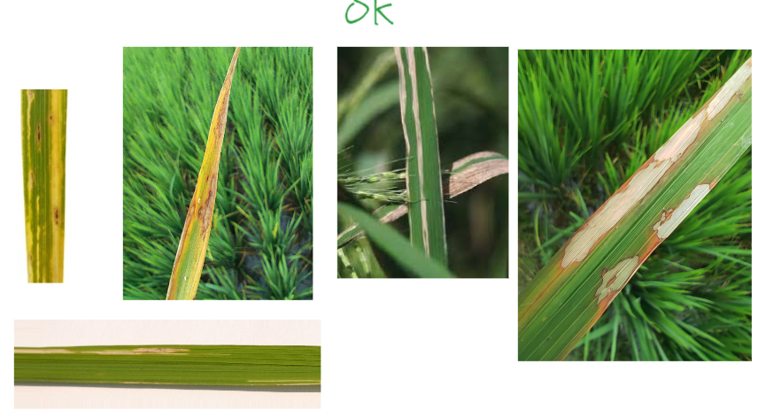

In this experiment, the dataset is restricted to images where a single leaf is the dominant object in the frame. Images showing multiple leaves, whole plants, stems, or broader field context are excluded.

baseline
>`best test acc: 0.5702746510505676  best val acc 0.942791759967804`
	
leaf only train and test dataset
>`best test acc: 0.4621099531650543 best val acc: 0.8251716494560242`

| TRAIN  | old  | leaf |
| ------ | ---- | ---- |
| blb    | 2656 | 561  |
| bls    | 409  | 27   |
| bpb    | 337  | -    |
| blast  | 3629 | 1123 |
| bs     | 2873 | 1074 |
| dh     | 1442 | -    |
| hispa  | 2374 | 682  |
| normal | 3719 | 1749 |
| sb     | 912  | 413  |

Here, performance again deteriorates. This process creates a large class imbalance and deletes a significant portion of the training data.

### 3. Training Data Refinement 

We next explore refinements that aim to reduce redundancy and noise without discarding any useful patterns for the model to learn from the training data.

#### i. Removing exact duplicate images
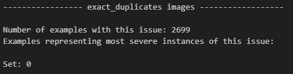
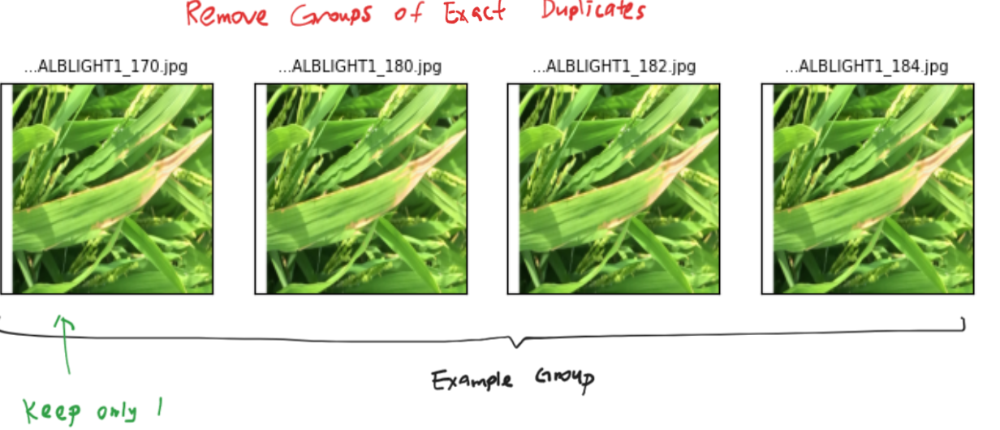

These duplicates can artificially inflate validation performance by allowing the model to memorize recurring visual patterns, while contributing little new information during training. Identical samples are identified and removed using CleanVision’s exact duplicate detection, which hashes images to find pixel-level duplicates across the dataset.

baseline
>`best test acc: 0.5702746510505676  best val acc 0.942791759967804`
	
no dupes
>`best test acc: 0.48465266823768616 best val acc: 0.9437071084976196`

| TRAIN  | old  | curated |
| ------ | ---- | ------- |
| blb    | 2656 | 1922    |
| bls    | 409  | 369     |
| bpb    | 337  | 303     |
| blast  | 3629 | 3538    |
| bs     | 2873 | 2701    |
| dh     | 1442 | 1328    |
| hispa  | 2374 | 2066    |
| normal | 3719 | 3269    |
| sb     | 912  | 376     |

No real training improvements for this one. Though it did help with reduced training times and faster convergence.
#### ii. Cropping images to focus on discriminative regions
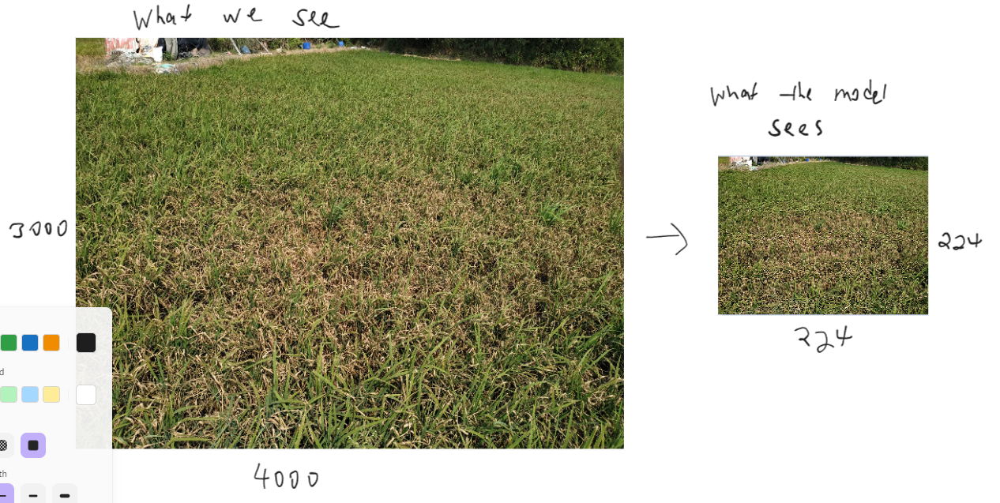
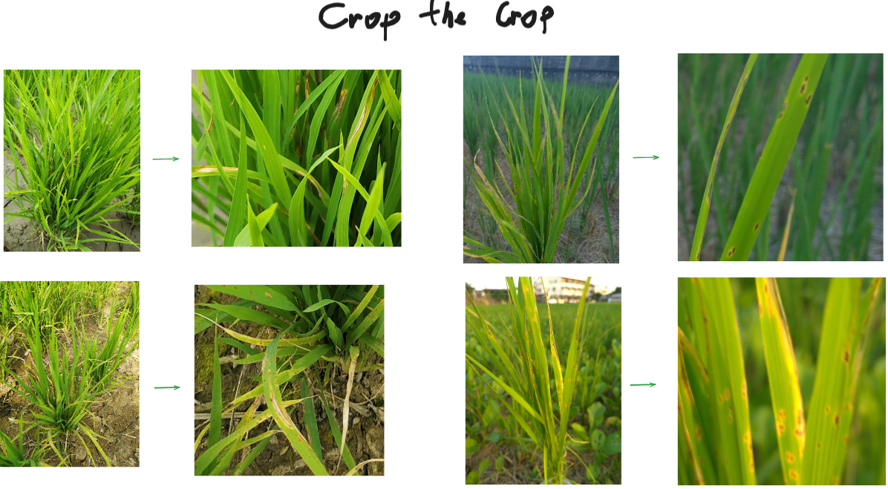

This experiment attempts to reduce background noise while preserving semantic content by cropping images around the disease-relevant regions. The intent is also to address a possible representation bottleneck introduced by mandatory resizing. All models used in this work ultimately operate on images resized to 224 × 224, regardless of the original image resolution or aspect ratio. When large field images or multi-leaf scenes are downsampled into this fixed input size, disease symptoms that occupy only a small fraction of the image can become severely compressed or visually diluted.

Manual cropping is performed on all images whose largest dimension exceeds 1000 pixels. Each image is cropped to the smallest region that still clearly contains the visible disease characteristics, ensuring that they remain prominent after resizing. The goal is not to localize lesions precisely, but to remove some irrelevant background and to ensure that the useful patterns are not overwhelmed by noise.

baseline
>`best test acc: 0.5702746510505676  best val acc 0.942791759967804`
	
cropped train, normal test
>`best test acc: 0.5786 best val acc: 0.939130425453186`
	
cropped train, cropped test
>`best test acc: 0.607038140296936 best val acc: 0.939130425453186`

>[!IMPORTANT]
>Cropping the training data alone results in a modest improvement in testing accuracy

Suggesting that emphasizing discriminative regions helps the model learn more robust disease representations even when evaluated on uncropped images. The largest gain is observed when both training and testing data are cropped, whereby ensuring that disease characteristics remain visually salient at 224 × 224 resolution.

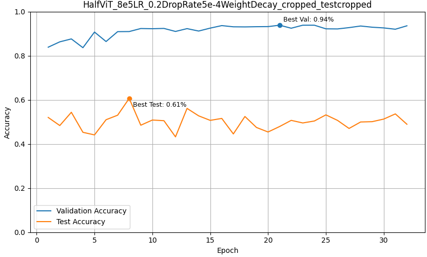
The accuracies also do not dip as aggressively
### 4. Emphasizing Local Features rather than Global Features: Return to CNNs

We observe that making diseased regions larger and more visually salient within the input image makes them easier for the model to learn. By reducing background clutter and ensuring that disease characteristics occupy a greater proportion of the 224 × 224 input, cropping implicitly shifts the learning problem toward recognizing localized patterns such as lesion texture, edges, and color irregularities. This allows the model an easier time learning local visual cues rather than global scene-level context. This raises an important architectural question: What if CNNs perform better now that this is the case?

Vision Transformers, in principle, have the flexibility to model both local and global features. Self-attention does not enforce a fixed receptive field, allowing the model to adaptively attend to either nearby or distant patches depending on the task. As a result, the balance between local and global reasoning in ViTs is largely determined by how representations evolve across layers rather than being explicitly constrained by the architecture. This behavior is consistent with our empirical observations. When freezing earlier layers of the ViT during fine-tuning, small but consistent improvements in generalization were observed. This suggests that the lower-layer representations from the pretraning is already well suited for disease recognition and benefit from being preserved.

Convolutional Neural Networks, by contrast, impose locality by design due to its explicit inductive bias. Through spatially constrained kernels and hierarchical receptive field growth, CNNs prioritize local pattern extraction before integrating global context. This makes them naturally aligned with fine-grained disease classification, where subtle texture and edge-based cues dominate the decision process. Motivated by these considerations, we revisit CNN-based architectures and evaluate ConvNeXt as a representative modern CNN.

Baseline Half Frozen ViT
>`best test acc: 0.5702746510505676  best val acc 0.942791759967804`
	
ConvNeXt base (ConvNeXt_8e5LR_0.2DropRate5e-4WeightDecay_cropped_testn0neckcropped)
>`best test acc: 0.6568915247917175 best val acc: 0.9524027705192566`
	
Convnextv2_384
>`took too long to train (overnight for 3 epochs)`

>[!IMPORTANT]
>A decent improvement!

When combined with cropped inputs that emphasize disease regions, ConvNeXt demonstrates a substantially improved ability to generalize.

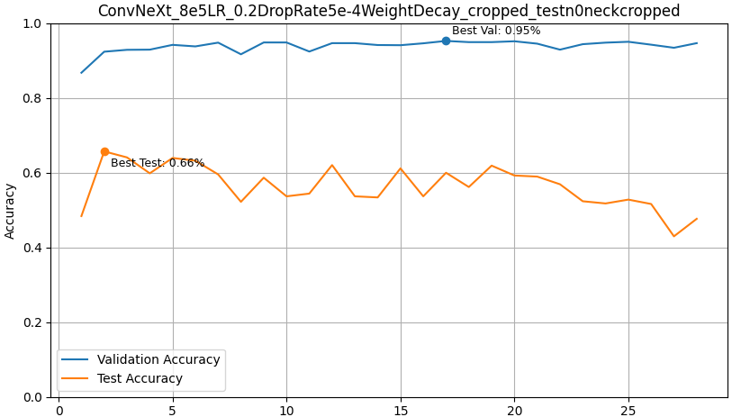
Testing accuracies were also comparatively much more stable

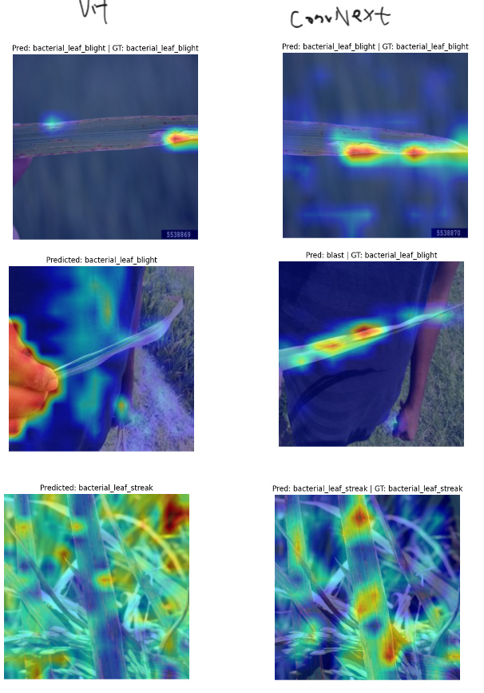

Looking at the class activations, we also see a decent group of images that better cover the diseased lesions rather than focusing on noise.
#### Freezing strategies in ConvNeXt

Given the observed gains from cropping and the improved performance of ConvNeXt, we next investigate which components of the network should remain frozen during fine-tuning. The motivation mirrors earlier ViT experiments: pretrained lower-level features may already encode generally useful local representations, and selectively freezing parts of the network may reduce overfitting while preserving these inductive biases.

Several freezing strategies are evaluated, each progressively constraining the model’s ability to adapt its convolutional feature extractors.

Baseline Half Frozen ViT
>`best test acc: 0.5702746510505676  best val acc 0.942791759967804`
	
ConvNeXt base (ConvNeXt_8e5LR_0.2DropRate5e-4WeightDecay_cropped_testn0neckcropped)
>`best test acc: 0.6568915247917175 best val acc: 0.9524027705192566`
	
ConvNeXts0s1freeze_8e5LR_0.2DropRate5e-4WeightDecay_cropped_testn0neckcropped
>`best test acc: 0.6686217188835144 best val acc: 0.9524027705192566`
	
ConvNeXtfreezedepthconvs_8e5LR_0.2DropRate5e-4WeightDecay_cropped_testn0neckcropped
>`best test acc: 0.6656891703605652 best val acc: 0.9560640454292297`
	
ConvNeXtfreezeallconvs_8e5LR_0.2DropRate5e-4WeightDecay_cropped_testn0neckcropped 
>`best test acc: 0.7023460268974304 best val acc: 0.9546910524368286`
	
ConvNeXtfreezeallconvsfreezes0s1MLP_8e5LR_0.2DropRate5e-4WeightDecay_cropped_testn0neckcropped 
>`best test acc: 0.6979472041130066 best val acc: 0.9546910524368286`
	
ConvNeXtFreezeSpatialMixing_8e5LR_0.2DropRate5e-4WeightDecay_cropped_testn0neckcropped
>`best test acc: 0.6583577990531921 best val acc: 0.9514874219894409`
	
ConvNeXtFreezeallconvs_newAug_8e5LR_0.2DropRate5e-4WeightDecay_cropped_testn0neckcropped
>`best test acc: 0.6730205416679382 best val acc: 0.9496567249298096`

>[!IMPORTANT]
>and we achieve our new best test acc of 0.7023460268974304 when freezing all convolution layers

Testing accuracies were also comparatively much more stable

First tried to force presence/absence detector through modified ViT with multi-instance learning, did not help.
ViTClassSpecificMIL_8e5LR_0.2DropRate5e-4WeightDecay_testn0neck | best val acc: 0.9135011434555054  best test acc: 0.3713490962982178

___
Delete each class to see if any jumps in performance
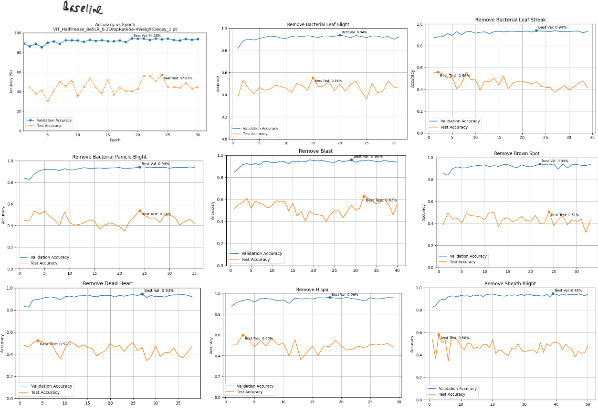
